1. Create GitHub account
2. Click on the **New** button >> Enter Repository name >> Select **Public / Private** >> Click on the **Create repository**
3. Click on the **Code** dropdown >> Copy link from HTTPS tab
4. Navigate to IntellijIdea
5. Click on the **Menu** >> New >> Project from version control >> Paste the copied git url >> Click on the **clone** >> Same name project will create in a new window
6. Click **Menu** >> **Git** >> **Commit**
7. Add commit message >> Click on the **Commit**
8. Click **Menu** >> **Git** >> **Push**
 >>  **origin : main >> Code will reflect in main branch on GitHub**
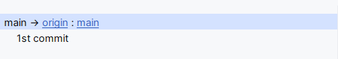
9. Branch Creation :: 
A. Navigate to GitHub >> Open repository >> Click on **Branch** >> **New Branch** >> **Enter name of the branch** >> **Create new branch**
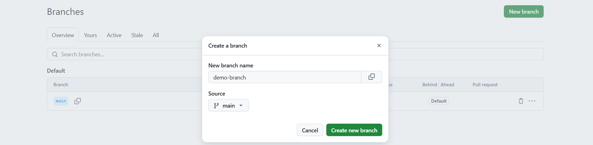
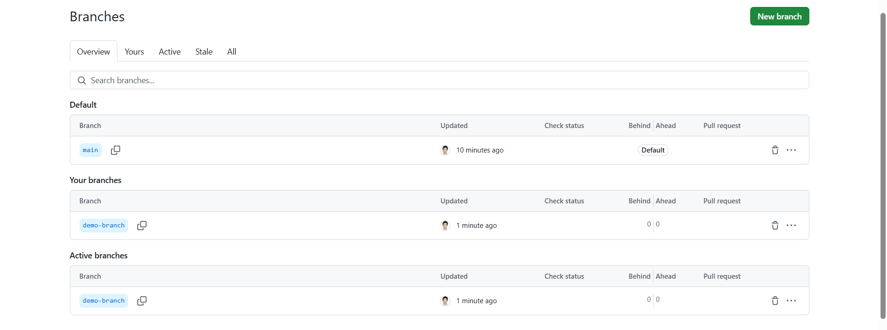
B. Navigate to intellijIdea >> **Menu** >> **Git** >> **Fetch** >> Click on **main** dropdown >> expand **Remote**  >> **origin**
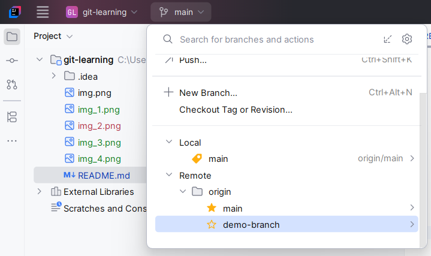
C. Click on the **Checkout** >> Perform the changes in your code >> Commit >> Push that code to your branch (demo-branch)

Create Pull Request:
10. Navigate to GitHub >> Click on the branch (demo-branch) >> Compare & pull request / N Commits ahead >> Click >> Create pull request >> Merge pull request >> Confirm merge
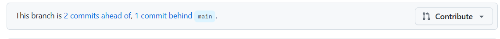
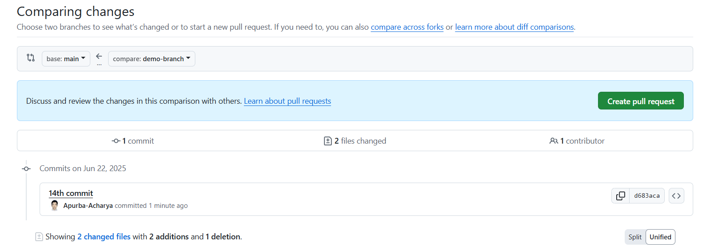
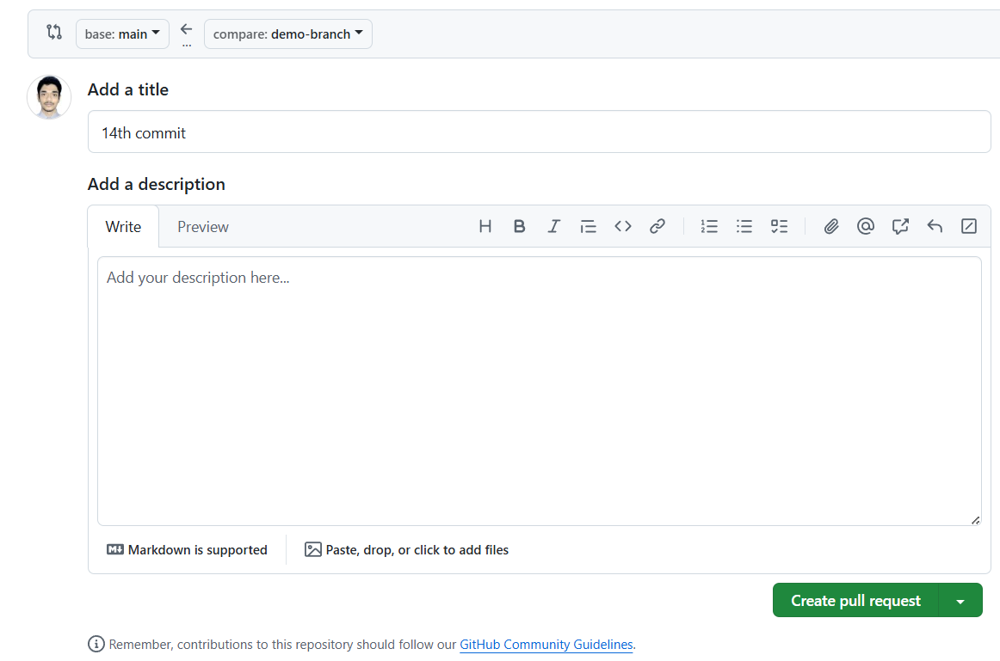
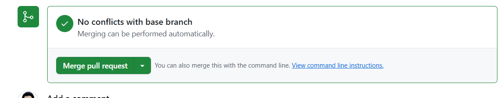
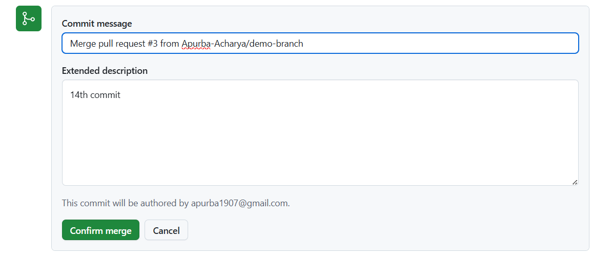
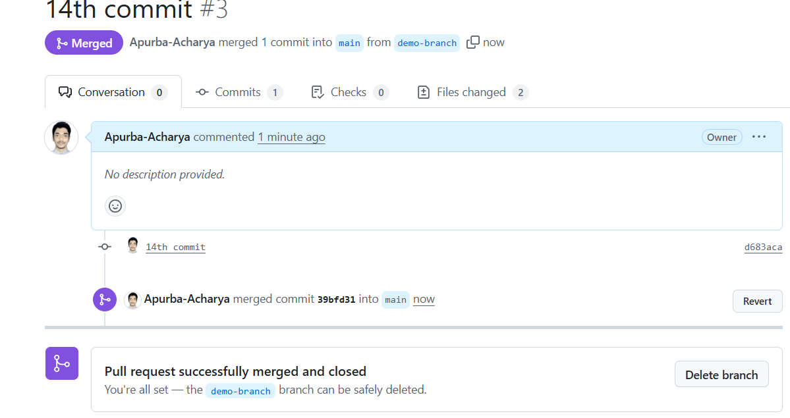
11. DIstributed and Centralized version control:

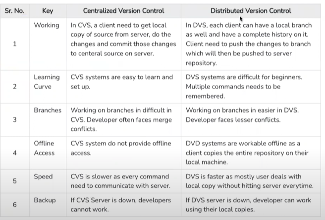
12. Git init: in terminal needs to execute **git init**
A. To create a git repo (in .git folder). If it is already exist it will fetch the existing file.
B. Unversioned project -->> Versioned
C. Or do: menu >> Git >> Show git log
**If user uncheck the Create Git repository checkbox then .git folder will not create in your project. So to enable VCS (Version Control System) navigate to Menu >> VCS >> Enable Version Control System >> Select version control application from the dropdown >> .git file will display under your project folder.**
13. 

