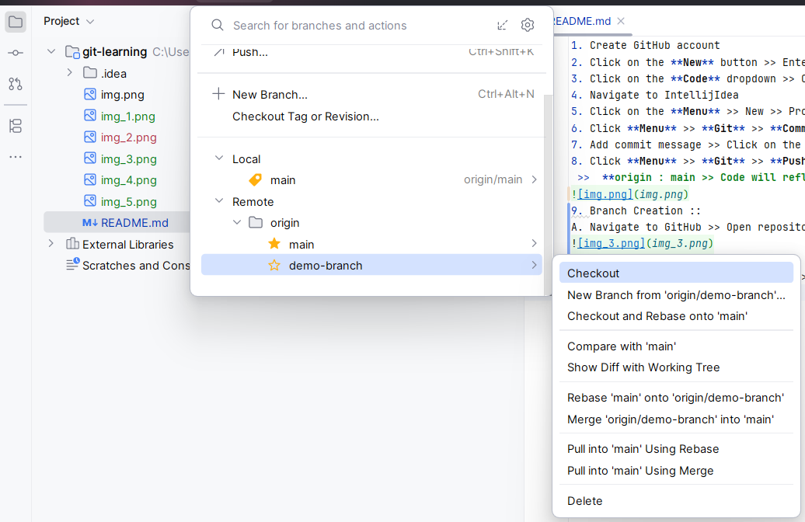

1. Create GitHub account
2. Click on the **New** button >> Enter Repository name >> Select **Public / Private** >> Click on the **Create repository**
3. Click on the **Code** dropdown >> Copy link from HTTPS tab
4. Navigate to IntellijIdea
5. Click on the **Menu** >> New >> Project from version control >> Paste the copied git url >> Click on the **clone** >> Same name project will create in a new window
6. Click **Menu** >> **Git** >> **Commit**
7. Add commit message >> Click on the **Commit**
8. Click **Menu** >> **Git** >> **Push**
 >>  **origin : main >> Code will reflect in main branch on GitHub**

9. Branch Creation :: 
A. Navigate to GitHub >> Open repository >> Click on **Branch** >> **New Branch** >> **Enter name of the branch** >> **Create new branch**

B. Navigate to intellijIdea >> **Menu** >> **Git** >> **Fetch** >> Click on **main** dropdown >> expand **Remote**  >> **origin**

C. Click on the **Checkout** >> Perform the changes in your code
